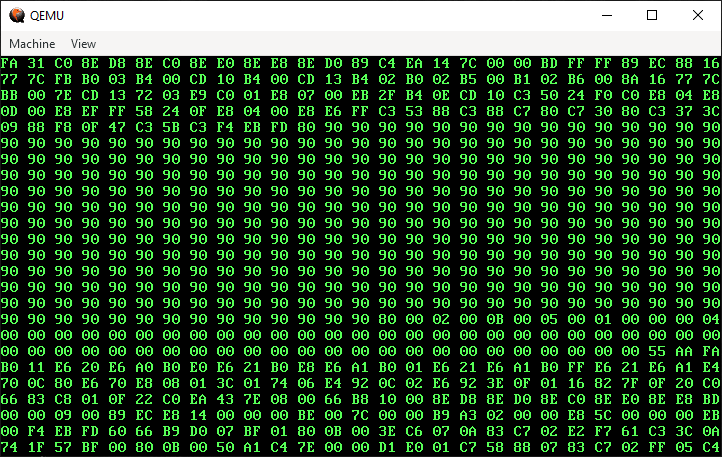

⚠️ **DO NOT TRY TO RUN IT ON YOUR HARDWARE! IT POTENTIALY CAN DAMAGE OR DESTROY IT. You have been warned!**

😇 ***Although it worked properly on my old laptop and desktop pc.***



# Installing build tools
> All operating systems, including Windows
 - [NASM assembler](https://nasm.us/) (nasm)
 - [LLVM toolchain](https://releases.llvm.org/) (clang, llvm-objcopy, ld.lld)
 - [QEMU emulator](https://www.qemu.org/download/) (qemu-system-i386)
> Make sure all tools available from PATH
# Building and running project
```
cd src

nasm -Werror -f elf32 -o ../build/bootloader.o bootloader.s

cd ../build

clang --target=i686-pc-none-elf -c -o kmain.o ../src/kmain.c

ld.lld -T linker.ld

llvm-objcopy --set-start=0x7c00 -O binary kernel.o kernel.bin

qemu-system-i386 -drive file=kernel.bin,format=raw
```
> To jump to C code uncomment line 138 in bootloader.s

### Sources
[Inside the Linux boot process](https://developer.ibm.com/articles/l-linuxboot/)
